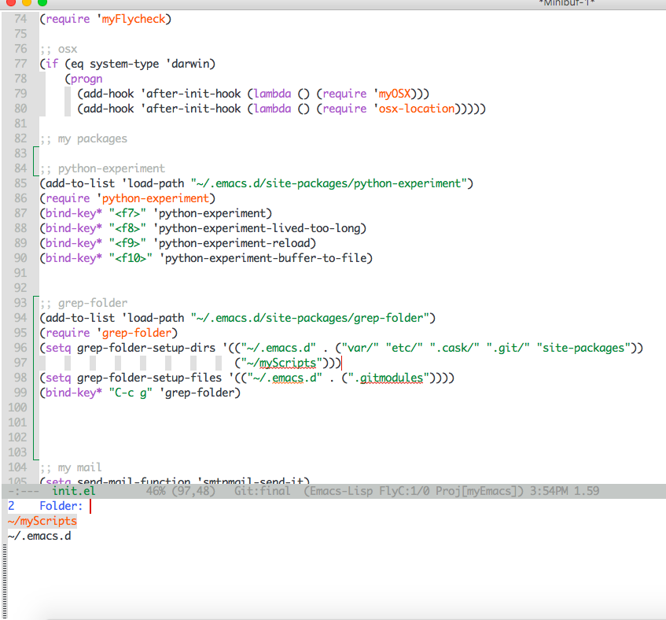

# grep-folder
Emacs small package to help you grep your folders and correct configure it.


I am using `grep` during all day long. I had written a function that was just perfect for me to grep my files. However, I started to need to extend that function to be work for other directories as well. I tried `counsel-git-grep`, but for some reason it is really tooo slow in my machine (MacBook Air (13-inch, 2017)) and I could not make the "exclude directories" and "exclude files" to work and get out a lot of unwanted results from my search. Therefore, I decided to improve a little bit of my functions and transform it in a small packages. Hope this could be useful to someone else.


# Instillation

``` emacs-lisp
(add-to-list 'load-path "~/.emacs.d/site-packages/grep-folder")
(require 'grep-folder)
(global-set-key (kbd "C-c g") 'grep-folder)

```


**IMPORTANT**: The version of your `grep` command should be `>=2.5.2`.

# Usage

After the installation you only need to fire `M-x grep-folder` and select the folder you want to grep.





By default there is only the `emacs.d` folder setup. Check how to add and customize the folder you desire below.


# Customization

The settings below remove the `var/`, `etc/`, `.cask/`, `.git/` and `site-packages` from the grep command inside my `emacs.d` directory.
It also adds the `myScript` folder to the initial menu.
``` emacs-lisp
(setq grep-folder-setup-dirs '(("~/.emacs.d" . ("var/" "etc/" ".cask/" ".git/" "site-packages"))
                               ("~/myScripts")))
(setq grep-folder-setup-files '(("~/.emacs.d" . (".gitmodules"))))
```


